# Référence design Figma — NOX

Catalogue des maquettes Figma pour l’app mobile NOX.  
Les images sont versionnées dans le dépôt : `docs/mobile/design-figma/`.

**Couleur principale** : `#4DA3FF` (bleu Figma) · **Typo** : Satoshi Variable  
**Voir aussi** : [SYNTHESE_REFONTE_NOX_JUIN2026.md](./SYNTHESE_REFONTE_NOX_JUIN2026.md) pour l’état d’implémentation.

---

## Design system

### Composants & navigation

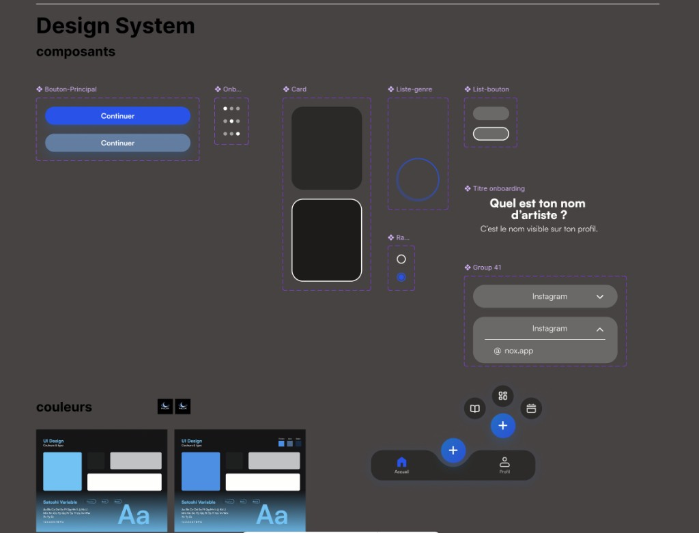

| Élément | Détail |
|---------|--------|
| Bouton principal | Pill bleu actif, gris-bleu inactif, texte « Continuer » |
| Onboarding dots | 3–4 points, point actif blanc |
| Cards | Fond gris foncé, variante avec bordure blanche |
| Liste / radio | Sélection circulaire bleue |
| Inputs / dropdowns | Champ pill gris, chevron, état étendu avec sous-champ |
| Bottom nav | Accueil · FAB `+` central bleu · Profil |
| Nav radiale NX | Menu semi-circulaire : Discover, Home, Tickets, Notifications, Profile |

### Couleurs & typographie

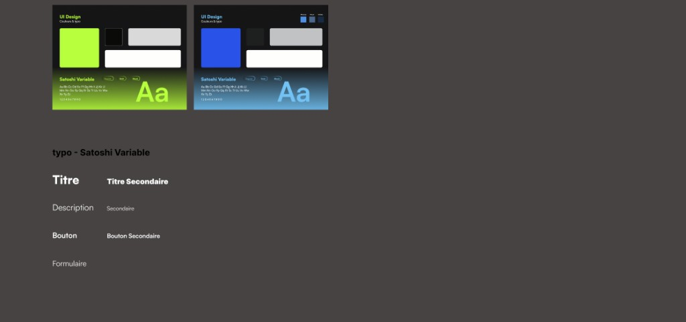

| Style | Usage |
|-------|-------|
| **Titre** | Grand, Bold |
| **Titre secondaire** | Moyen, Bold |
| **Description** | Regular |
| **Secondaire** | Petit, gris clair |
| **Bouton** | Bold |
| **Bouton secondaire** | Petit, Regular |
| **Formulaire** | Petit, Regular |

**Palette** : fond `#000000`, cartes `#2C2C2E`, texte blanc, accent bleu `#2F54EB` / `#4DA3FF`.

---

## Onboarding & Auth (général)

### Splash + slides onboarding + inscription

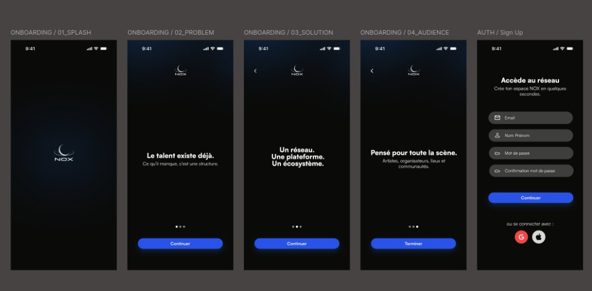

| Écran | Contenu |
|-------|---------|
| `01_SPLASH` | Logo NOX, glow bleu |
| `02_PROBLEM` | « Le talent existe déjà. Ce qu’il manque, c’est une structure. » |
| `03_SOLUTION` | « Un réseau. Une plateforme. Un écosystème. » |
| `04_AUDIENCE` | « Pensé pour toute la scène. » + bouton « Terminer » |
| `AUTH / Sign Up` | Email, nom, mot de passe, confirmation, Google / Apple |

### Vérification email + choix de rôle

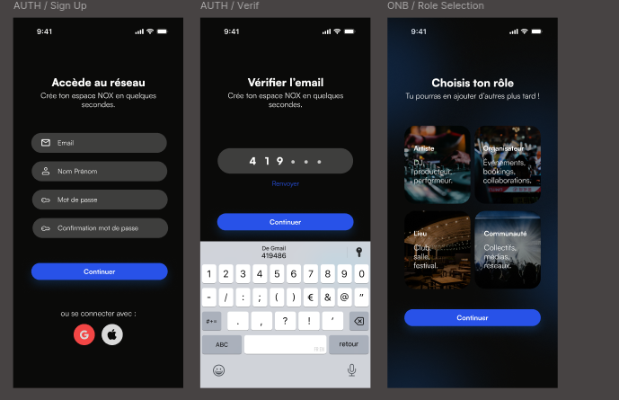

| Écran | Contenu |
|-------|---------|
| `AUTH / Sign Up` | (reprise) |
| `AUTH / Verif` | OTP 6 chiffres, lien « Renvoyer » |
| `ONB / Role Selection` | Grille Artiste · Organisateur · Lieu · Communauté |

---

## Wireframe global

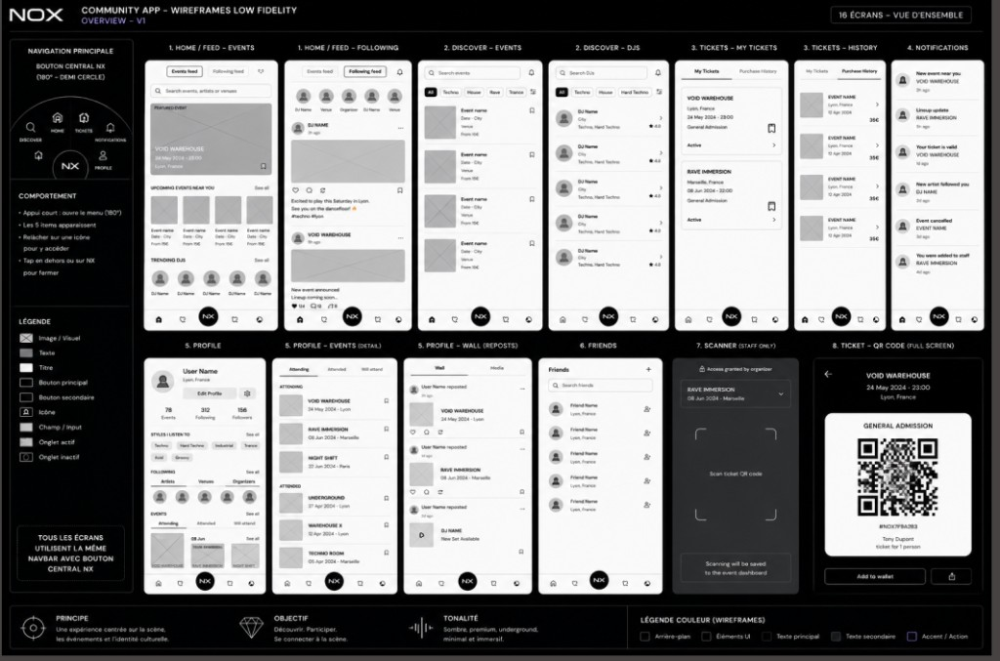

**Navigation** : barre basse persistante, bouton central **NX** → menu radial 180°.

| Zone | Écrans |
|------|--------|
| Home | Events feed, Following feed |
| Discover | Events, DJs (filtres genre) |
| Tickets | Mes billets, Historique |
| Notifications | Liste groupée par période |
| Profile | Overview, Events, Wall, Friends |
| Staff | Scanner QR, Ticket QR plein écran |

---

## Communauté

### Onboarding communauté (8 étapes)

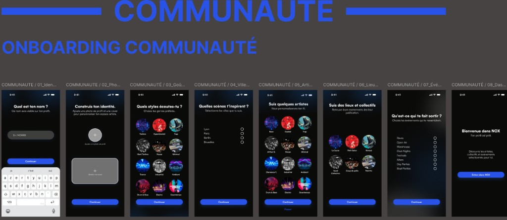

1. **Identité** — « Quel est ton nom ? »
2. **Photo / cover** — « Construis ton identité. »
3. **Goûts musicaux** — grille genres (Techno, House, Trance…)
4. **Villes** — Lyon, Paris, Berlin, Bruxelles
5. **Artistes** — suivi suggéré (+ « Passer »)
6. **Lieux & collectifs** — Le Sucre, Ninkasi, Vandale…
7. **Types d’événements** — Raves, Open Air, Warehouse…
8. **Bienvenue** — « Entrer dans NOX »

### Home, détail événement, Discover

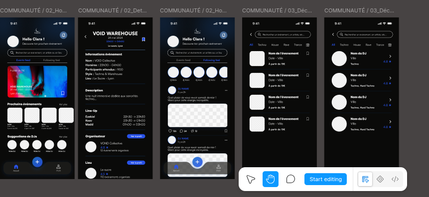

| Écran | Fichier code (approx.) |
|-------|------------------------|
| Home / Events feed | `screens/community/CommunityHomePage.js` |
| Event detail | `screens/community/CommunityEventDetailPage.js` |
| Following feed | `components/community/CommunityFeedStream.js` |
| Discover events | `screens/community/CommunityDiscoverPage.js` |
| Discover DJs | `screens/community/CommunityDiscoverPage.js` |

### Notifications

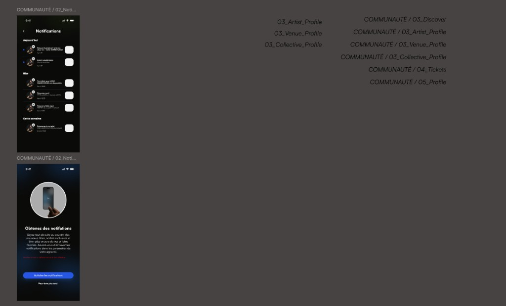

| Écran | Contenu |
|-------|---------|
| `02_Notifications` | Groupées Aujourd’hui / Hier / Cette semaine |
| Opt-in | « Obtenez des notifications » + « Activer » / « Peut-être plus tard » |

---

## Lieux (venue)

### Dashboard, profil, média, feed, disponibilités

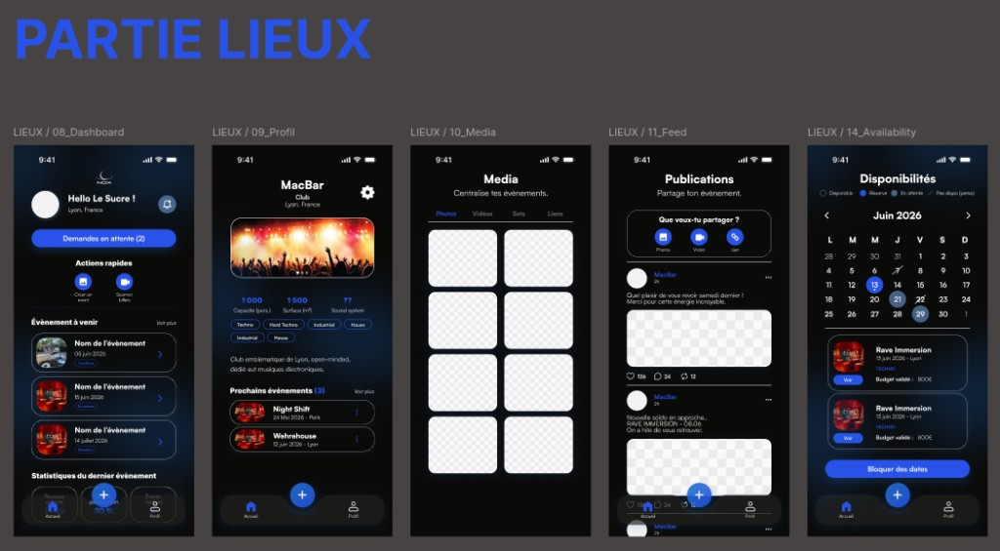

| Écran | Fichier code (approx.) |
|-------|------------------------|
| `08_Dashboard` | `screens/lieux/LieuxDashboardPage.js` |
| `09_Profil` | `screens/lieux/LieuxProfilPage.js` |
| `10_Media` | `screens/lieux/LieuxMediaPage.js` |
| `11_Feed` | (publications lieu) |
| `14_Availability` | `screens/lieux/LieuxAvailabilityPage.js` |

> Variante proche : [10-lieux-dashboard-profil-media-v2.png](./design-figma/10-lieux-dashboard-profil-media-v2.png)

### Events, staff, scanner, demandes

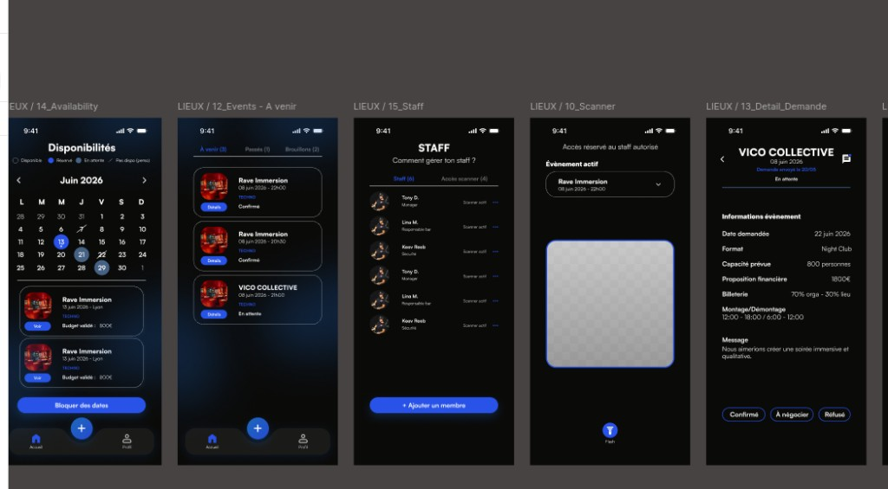

| Écran | Contenu |
|-------|---------|
| `14_Availability` | Calendrier juin 2026, légende dispo/réservé/en attente |
| `12_Events` | Onglets À venir · Passés · Brouillons |
| `15_Staff` | Liste staff + onglet « Accès scanner » |
| `10_Scanner` | Viewfinder QR, sélecteur événement |
| `13_Detail_Demande` | VICO COLLECTIVE — Confirmé / À négocier / Refusé |

### Détail événement validé

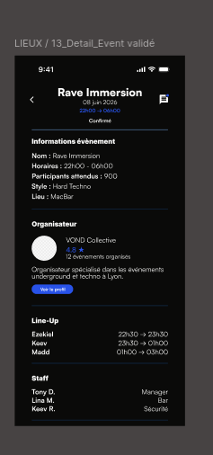

Écran `13_Detail_Event validé` : infos, organisateur, line-up, staff.

### Notifications, réglages, création, brouillons

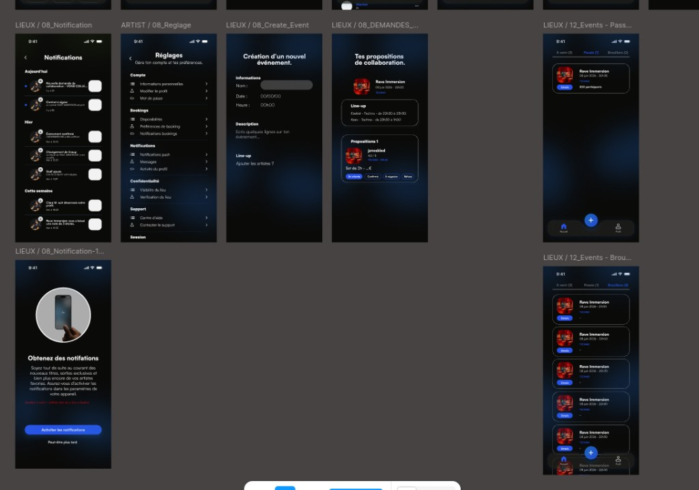

| Écran | Contenu |
|-------|---------|
| `08_Notification` | Demandes collaboration, contrats, confirmations |
| `08_Reglage` | Compte, bookings, notifications, confidentialité |
| `08_Create_Event` | Nom, date, heure, description, line-up |
| `08_DEMANDES` | Propositions artistes + statuts | `screens/lieux/LieuxDemandesPage.js` |
| `12_Events` | Passés, Brouillons, opt-in notifications |

### Messagerie booking

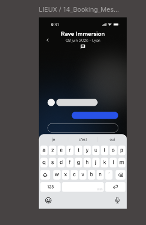

Écran `14_Booking_Messagerie` : fil de discussion lié à un événement / demande.

---

## Index rapide des fichiers image

| Fichier | Section |
|---------|---------|
| `01-design-system-composants.png` | Design system |
| `02-design-system-couleurs-typo.png` | Design system |
| `03-onboarding-auth-splash.png` | Auth global |
| `04-auth-verif-choix-role.png` | Auth global |
| `05-wireframe-overview.png` | Architecture |
| `06-communaute-onboarding.png` | Communauté |
| `07-communaute-home-discover.png` | Communauté |
| `08-communaute-notifications.png` | Communauté |
| `09-lieux-dashboard-profil-media.png` | Lieux |
| `10-lieux-dashboard-profil-media-v2.png` | Lieux (variante) |
| `11-lieux-events-staff-scanner.png` | Lieux |
| `12-lieux-detail-event-valide.png` | Lieux |
| `13-lieux-notifications-settings-events.png` | Lieux |
| `14-lieux-booking-messagerie.png` | Lieux |

---

*Dernière mise à jour : juillet 2026 — maquettes importées depuis Figma.*
