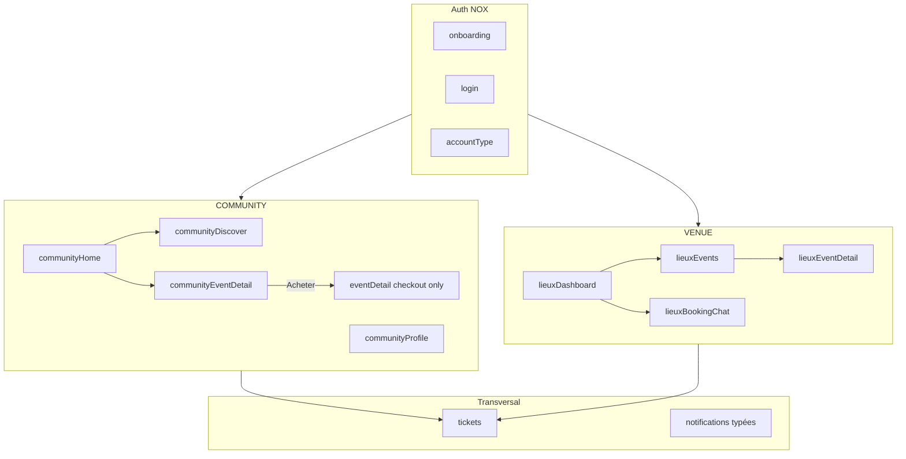

# Plan de migration NOX ↔ Legacy

Document de référence pour **terminer la bascule Figma** sans casser la prod.  
Complète [DESIGN_FIGMA_REFERENCE.md](./DESIGN_FIGMA_REFERENCE.md) et [SYNTHESE_REFONTE_NOX_JUIN2026.md](./SYNTHESE_REFONTE_NOX_JUIN2026.md).

**Branche cible** : `railway-phase1` · **App** : `insane-nights-days-mobile/`

---

## 1. Rappel : deux parcours dans une seule app

| | **NOX** (cible Figma) | **Legacy** (ancienne app) |
|---|------------------------|---------------------------|
| **Design** | Noir, Satoshi, `components/nox/*` | Styles propres par écran, UI hétérogène |
| **Nav principale** | Radial NX + bottom bar Lieux | Drawer + dashboards onglets |
| **Exemples d’écrans** | `communityHome`, `lieuxDashboard` | `welcome`, `events`, `venueDashboard` |
| **Statut** | En construction | Encore source de vérité pour une partie du métier |

**Objectif** : un seul parcours visible par profil, avec **réutilisation de la logique** legacy (hooks, API) là où l’UI change seulement.

---

## 2. Principes de migration

1. **Ne pas supprimer un écran legacy tant que son remplaçant NOX couvre la même feature** (API + navigation + edge cases).
2. **Extraire la logique, jeter l’UI** : `useVenueDashboard` → hooks partagés ; pages NOX consomment les mêmes appels API.
3. **Un écran = une responsabilité** : découverte ≠ achat billet ≠ gestion pro lieu.
4. **Navigation par profil** : la clé d’écran dépend de `activeProfileType` (voir `noxRoleNavigation.js`).
5. **Legacy en repli explicite** : si un flux NOX n’est pas prêt, documenter le repli temporaire dans ce fichier (pas de lien « fantôme »).

---

## 3. Inventaire écran par écran

Légende : **Garder NOX** · **Réutiliser tel quel** · **Migrer UI** · **Supprimer plus tard** · **À créer**

### 3.1 Auth & boot (commun à tous)

| Clé | Fichier | Décision | Notes |
|-----|---------|----------|-------|
| `onboarding` | `OnboardingPage.js` | **Garder NOX** | Ajouter splash Figma (`01_SPLASH`) en option |
| `login` | `LoginPage.js` | **Garder NOX** | |
| `accountType` | `AccountTypePage.js` | **Garder NOX** | Prestataire = hors Figma mais produit |
| `registerCommunity` | `RegisterCommunityPage.js` | **Migrer UI** | Fusionner avec Sign Up Figma ou alléger champs |
| `registerDj/Booker/Venue/Prestataire` | `Register*.js` | **Migrer UI** | Thème NOX progressif |
| — | Écran OTP (`AUTH / Verif`) | **À créer** | `AuthVerifyEmailPage.js` post-inscription |
| — | Opt-in push | **À créer** | `NotificationsOptInPage.js` (Figma 08) |

### 3.2 Communauté (profil `COMMUNITY`)

| Clé | Fichier | Décision | Remplace / remplacé par |
|-----|---------|----------|-------------------------|
| `communityOnboarding` | `CommunityOnboardingPage.js` | **Garder NOX** | Corriger « Passer » étape 5 |
| `communityHome` | `CommunityHomePage.js` | **Garder NOX** | Remplace `welcome` pour COMMUNITY |
| `communityDiscover` | `CommunityDiscoverPage.js` | **Garder NOX** | **Doit remplacer** `events` pour COMMUNITY |
| `communityEventDetail` | `CommunityEventDetailPage.js` | **Garder NOX** | **Doit remplacer** `eventDetail` pour la vue sociale |
| `events` | `EventsPage.js` | **Supprimer plus tard** | Alias temporaire → rediriger vers `communityDiscover` |
| `eventDetail` | `EventDetailPage.js` | **Réutiliser tel quel** | **Uniquement** flux achat / billet / post-achat / staff public |
| `tickets` | `TicketsPage.js` | **NOX wallet (31 juil.)** | Wireframe 05 ; pas de maquette HD |
| `notifications` | `NotificationsPage.js` | **NOX (31 juil.)** | Aligné Figma 08 communauté |
| `profile` | `ProfilePage.js` | **Hub compte NOX (31 juil.)** | Inspiré 08_Reglage Lieux ; pas de maquette HD compte |
| — | `CommunityProfilePage.js` | **Migrer UI** | Profil public + onglets Events/Wall (Figma 05) |
| `communityFriends` | `CommunityFriendsPage.js` | **Migrer UI** | Entrée NX ou profil, pas drawer seul |
| `welcome` | `WelcomePage.js` | **Supprimer plus tard** | Plus d’accueil COMMUNITY |
| `home` | `HomePage.js` | **Supprimer plus tard** | Page publique legacy |
| `feed` / `createFeedPost` | `FeedPage.js` etc. | **Migrer UI** | Intégrer dans onglet Publications home |

### 3.3 Lieu (profil `VENUE`)

| Clé | Fichier | Décision | Notes |
|-----|---------|----------|-------|
| `lieuxDashboard` | `LieuxDashboardPage.js` | **Garder NOX** | Corriger quick actions + FAB |
| `lieuxProfil` | `LieuxProfilPage.js` | **Garder NOX** | Stats surface / sound system |
| `lieuxMedia` | `LieuxMediaPage.js` | **Garder NOX** | + upload |
| `lieuxAvailability` | `LieuxAvailabilityPage.js` | **Garder NOX** | Calendrier alimenté + bloquer dates |
| `lieuxRequestDetail` | `LieuxRequestDetailPage.js` | **Garder NOX** | Pills footer, plus de `venueDashboard` |
| `venueDashboard` | `VenueDashboardPage.js` | **Supprimer plus tard** | Logique → hooks partagés |
| `venueProfileEdit` | `VenueProfileEditPage.js` | **Réutiliser tel quel** | Sous-écran réglages jusqu’à `lieuxSettings` |
| `eventDetail` | `EventDetailPage.js` | **Ne pas utiliser** | Remplacer par `lieuxEventDetail` (à créer) |
| `scanTicket` | `ScanTicketPage.js` | **Migrer UI** | Wrapper NOX + sélecteur event |
| `eventStaff` | `EventStaffPage.js` | **Réutiliser logique** | Intégrer dans `lieuxStaff` |
| — | `lieuxFeed` | **À créer** | Figma `11_Feed` |
| — | `lieuxEvents` | **À créer** | Figma `12_Events` (3 onglets) |
| — | `lieuxEventDetail` | **À créer** | Figma `13_Detail_Event validé` |
| — | `lieuxStaff` | **À créer** | Figma `15_Staff` |
| — | `lieuxScanner` | **À créer** | Figma `10_Scanner` (ou skin NOX de `scanTicket`) |
| — | `lieuxSettings` | **À créer** | Figma `08_Reglage` |
| — | `lieuxCreateEvent` | **À créer** | Figma `08_Create_Event` |
| — | `lieuxBookingChat` | **À créer** | Extraire `VenueChatModal` + `useVenueDashboard` chat |
| — | `lieuxNotifications` | **À créer** | Notifs métier lieu |
| — | `lieuxDemandes` | **À créer** | Propositions artistes (Figma `08_DEMANDES`) |

### 3.4 Pro — DJ / Booker / Prestataire

| Clé | Fichier | Décision | Notes |
|-----|---------|----------|-------|
| `welcome` | `WelcomePage.js` | **Inspiré NOX (31 juil.)** | Accueil pro temporaire — **pas de maquette ARTIST/ORGA** |
| `djDashboard` | `DjDashboardPage.js` | **Migrer UI** | Dashboard secondaire (drawer/NX) |
| `bookerDashboard` | `BookerDashboardPage.js` | **Migrer UI** | Idem |
| `bookerEventDashboard` | `BookerEventDashboardPage.js` | **Migrer UI** | Wizard event booker |
| `prestataireDashboard` | `PrestataireDashboardPage.js` | **Migrer UI** | Hors maquettes actuelles |
| Profils publics | `DjProfilePage`, `VenueProfilePage`, `BookerProfilePage` | **NOX (31 juil.)** | Shell Figma + API inchangée |

### 3.5 Transversal (tous profils)

| Clé | Fichier | Décision |
|-----|---------|----------|
| `tickets` | `TicketsPage.js` | **NOX wallet (31 juil.)** — garder logique QR / historique |
| `purchases` / `purchaseSuccess` | `PurchasesPage.js` | **Migrer UI** |
| `scanTicket` / `staffEvents` | Scan + liste events staff | **Migrer UI** — accès staff |
| `switchProfile` | `SwitchProfilePage.js` | **Garder NOX** |
| `legal` | `LegalPage.js` | **Réutiliser tel quel** |
| `admin` | `AdminPage.js` | **Réutiliser tel quel** |

---

## 4. Règles de navigation cibles

### 4.1 Helper central (à implémenter)

Créer `utils/noxNavigation.js` :

```javascript
// Exemples de règles
export function getDiscoverScreen(profileType) {
  return profileType === 'COMMUNITY' ? 'communityDiscover' : 'events';
}

export function getEventPreviewScreen(profileType) {
  return profileType === 'COMMUNITY' ? 'communityEventDetail' : 'eventDetail';
}

export function getEventPurchaseScreen() {
  return 'eventDetail'; // toujours legacy jusqu’à EventCheckoutPage NOX
}
```

### 4.2 Matrice « tap événement »

| Contexte | Écran | CTA achat |
|----------|-------|-----------|
| Communauté — browse | `communityEventDetail` | Bouton « Acheter » → `eventDetail` (mode checkout) ou futur `eventCheckout` |
| Lieu — event confirmé | `lieuxEventDetail` | Pas d’achat |
| DJ/Booker — welcome | `eventDetail` ou futur NOX | Selon refonte pro |
| Ticket possédé | `tickets` (modal QR) | — |

### 4.3 Matrice NX radial (cible)

| Item NX | COMMUNITY | VENUE | DJ/BOOKER/PRESTATAIRE |
|---------|-----------|-------|------------------------|
| Discover | `communityDiscover` | `lieuxEvents` ou discover public | `events` → migrer |
| Home | `communityHome` | `lieuxDashboard` | `welcome` → migrer |
| Tickets | `tickets` | `tickets` (si staff) ou masqué | `tickets` |
| Notifs | `notifications` → puis typées | `lieuxNotifications` | `notifications` |
| Profil | `communityProfile` (nouveau) ou `profile` | `lieuxProfil` | `profile` |

---

## 5. Logique à extraire du legacy (ne pas réécrire)

| Hook / module legacy | Usage actuel | Cible NOX |
|----------------------|--------------|-----------|
| `useVenueDashboard.js` | Chat, contrats, bookings, médias, avis | `useVenueBookings.js`, `useVenueChat.js`, garder contrats |
| `useLieuxData.js` | Profil, bookings, media lieu | Étendre : calendrier, stats event |
| `VenueChatModal.js` | Chat orga ↔ lieu | `LieuxBookingChatPage.js` |
| `VenueBookingsTab.js` | Liste + réponses invitations | Déjà partiellement dans `lieuxRequestDetail` |
| `EventDetailPage.js` | Stripe / achat / calendrier perso | `eventDetail` ou futur `eventCheckout` |
| `ScanTicketPage.js` | Validation QR | `lieuxScanner` skin NOX |
| `useFeedNotifications.js` | Compteur + liste | Enrichir types + routing |

---

## 6. Phases de migration (ordre recommandé)

### Phase A — Quick wins (1–3 jours) · **sans nouvel écran**

Objectif : l’utilisateur ne « sort » plus du shell NOX sans raison.

| # | Tâche | Fichiers touchés |
|---|-------|------------------|
| A1 | NX Discover → `communityDiscover` si `COMMUNITY` | `NoxRadialNav.js` |
| A2 | Home communauté : search, voir plus, tap event → `communityDiscover` / `communityEventDetail` | `CommunityHomePage.js`, `CommunityFeedStream.js` |
| A3 | `communityEventDetail` : « Acheter » seul → `eventDetail` | `CommunityEventDetailPage.js` |
| A4 | Lieux : supprimer liens `venueDashboard` ; chat → `venueDashboard` **documenté temporaire** ou stub alert | `LieuxDashboardPage.js`, `LieuxRequestDetailPage.js` |
| A5 | FAB Lieux : bottom sheet (Média / Event bientôt / Publication bientôt) | `NoxBottomNav` ou composant `NoxCreateSheet` |
| A6 | `lieuxDashboard` : lire `openBookings` → scroll demandes ou `lieuxAvailability` | `LieuxDashboardPage.js` |
| A7 | `active` bottom nav cohérent sur Media / Availability | `LieuxMediaPage.js`, `LieuxAvailabilityPage.js` |

**Critère de fin Phase A** : parcours COMMUNITY entier en NOX sauf achat ; Lieux sans saut vers `venueDashboard` sauf chat (explicité).

---

### Phase B — Lieux métier (1–2 semaines)

| # | Écran | Priorité | Dépendance |
|---|-------|----------|------------|
| B1 | `lieuxBookingChat` | P0 | Extraire chat de `useVenueDashboard` |
| B2 | `lieuxEvents` | P0 | API bookings + statuts brouillon |
| B3 | `lieuxEventDetail` | P0 | Remplace `eventDetail` depuis Lieux |
| B4 | Calendrier `lieuxAvailability` | P1 | Mapping bookings → jours |
| B5 | `lieuxCreateEvent` | P1 | API création ou redirect booker |
| B6 | `lieuxSettings` + sous-écrans | P2 | Hub → `venueProfileEdit`, dispos, notifs |
| B7 | `lieuxStaff` + `lieuxScanner` | P2 | Réutiliser `EventStaffPage` / `ScanTicketPage` |
| B8 | `lieuxFeed` | P3 | API feed profil VENUE |
| B9 | `lieuxNotifications` | P3 | API notifs venue |

**Critère de fin Phase B** : profil VENUE n’ouvre plus `venueDashboard` ; `venueDashboard` marqué `@deprecated`.

---

### Phase C — Communauté social (1 semaine)

| # | Tâche |
|---|-------|
| C1 | Profil communauté Figma (overview, events, wall, friends) |
| C2 | `communityFriends` dans NX ou profil |
| C3 | Notifications typées + deep link |
| C4 | Opt-in push Figma |
| C5 | Bookmarks fonctionnels ou icônes retirées |
| C6 | Stories bar (optionnel P3) |

**Critère de fin Phase C** : `welcome` plus utilisé pour COMMUNITY ; `events` redirige ou supprimé pour ce profil.

---

### Phase D — Nettoyage legacy (continu)

| # | Action | Condition |
|---|--------|-----------|
| D1 | Supprimer `venueDashboard` | Phase B terminée + QA réservations/chat |
| D2 | Supprimer `EventsPage` pour COMMUNITY | Phase A + C OK |
| D3 | Scinder `eventDetail` → preview NOX + `eventCheckout` legacy | Quand achat refait ou skin NOX |
| D4 | Supprimer `WelcomePage` quand pro refait | Phase pro Figma |
| D5 | Supprimer `HomePage` public legacy | Si plus de landing in-app |
| D6 | Retirer `MenuPageOld.js` et scripts morts | Audit imports |

---

### Phase E — Pro DJ / Booker / Prestataire (backlog Figma)

Pas de maquettes complètes dans le pack actuel → **Migrer UI** progressivement :

1. Thème NOX sur dashboards existants (composants `nox/`)
2. Accueil pro unifié (remplace `welcome`)
3. Alignement Figma quand maquettes ARTIST / ORGA livrées

---

## 7. État cible simplifié



---

## 8. Checklist avant suppression d’un écran legacy

- [ ] Aucun `navigate('xxx')` restant (grep codebase)
- [ ] Drawer / NX / push notifications mis à jour
- [ ] Hook métier extrait et testé
- [ ] Entrée CHANGELOG + QA manuelle sur device
- [ ] Mention « supprimé » dans ce document

---

## 9. Suivi d’avancement

| Phase | Statut | Date cible |
|-------|--------|------------|
| A — Quick wins | ✅ Fait | 17 juil. 2026 |
| B — Lieux métier (B1–B9) | ✅ Fait | 4 août 2026 |
| C — Communauté social | ✅ Fait (mur/repost hors scope) | 31 juil. 2026 |
| D — Nettoyage legacy | 🟡 En cours (D1–D3, D6 faits) | 4 août 2026 |
| E — Pro DJ/Booker | 🟡 En cours (proHome + dashboards NOX) | 4 août 2026 |

Mettre à jour cette table à chaque livraison.

---

## 10. Prochaine action concrète

**Phase D suite + polish Phase E** :

1. QA parcours pro (`GUIDE_TEST_NOX.md`) : proHome → dashboard → retour NX  
2. `PurchasesPage` / `TicketsPage` : liens event → preview vs checkout explicites  
3. Mur profil communauté (wireframe WALL) si priorité produit  
4. Maquettes Figma ARTIST/ORGA pour pixel-perfect home pro  

---

*Créé le 17 juillet 2026 — à maintenir avec le CHANGELOG.*
